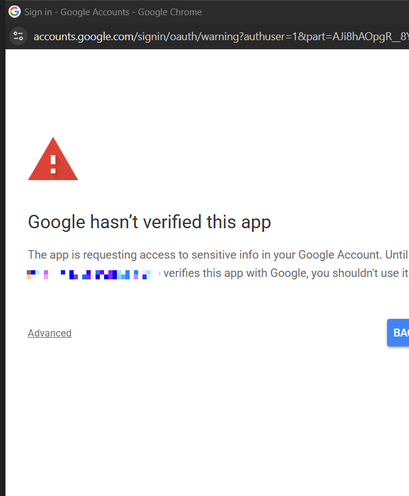
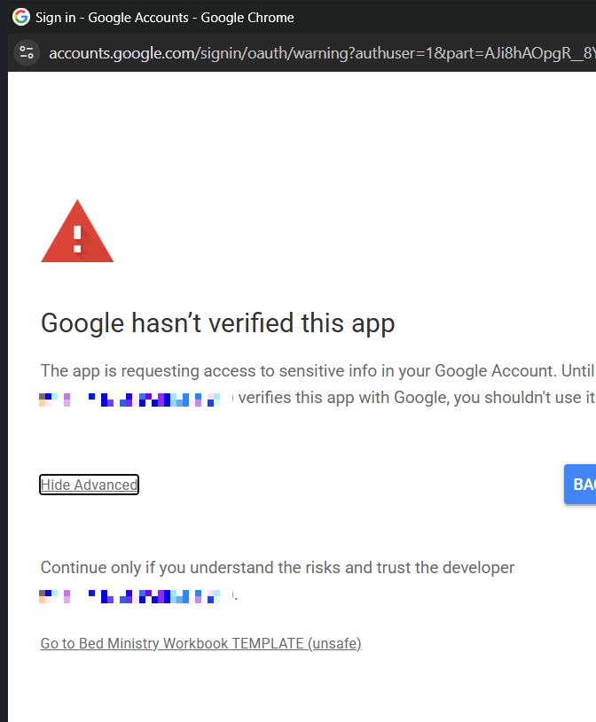
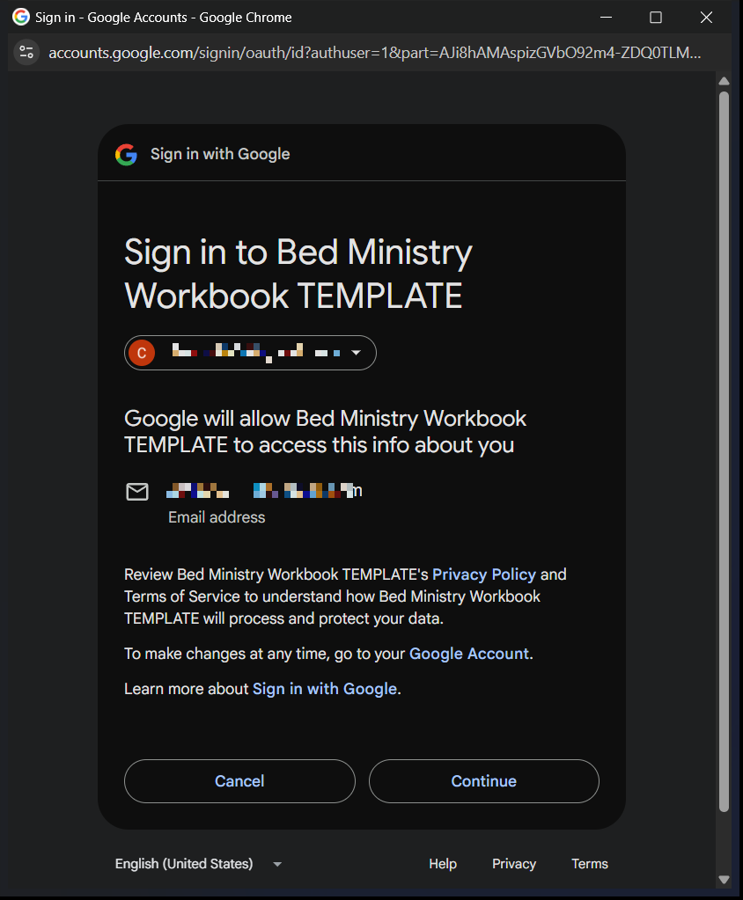
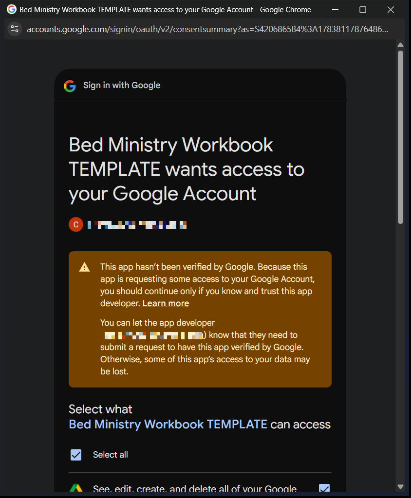

# START HERE — New City Launch Guide

*Bed Ministry Starter Kit — from "Make a copy" to your first test delivery in about two hours.*

Welcome! This guide takes one person — the **ministry lead**, whoever will
own the system in your city — from the shared starter-kit folder to a working
bed ministry system. You do not need any programming knowledge. You will
copy a spreadsheet, click through a five-minute setup wizard, get past two
scary-looking (but expected) Google warning screens, and run one pretend
request all the way through the system.

> **Screenshots** below are from a real new-city setup. The account email in
> Google's warning screens has been blurred out; the wording is exactly what
> you will see.

## Before you start

- **Pick the Google account that will own the system.** We strongly
  recommend a dedicated ministry account (for example,
  `beds@yourchurch.org` or a Gmail created for the ministry) rather than a
  personal one. The workbook will hold families' names, addresses, and
  children's information — see the *Data Care* one-pager, which is worth
  reading before you begin. Sign into that account now, in the browser you
  are using.
- **Have the starter-kit folder open** (the Drive folder link you were
  given, containing the template workbook and this guide).
- **Set aside about two hours.** The setup itself is minutes; the test
  drive and inventory count are most of the time.

## Step 1 — Copy the template workbook (10 min)

1. In the starter-kit folder, open **Bed Ministry Workbook TEMPLATE**.
2. Go to **File → Make a copy**.
3. Name your copy something like *Bed Requests — Riverside*, choose a
   location in **your own Drive**, and click **Make a copy**.
4. Your copy opens in a new tab. Work in your copy from here on — the
   template itself is read-only.

Two things to know about the copy:

- **You do not get the request form yet, and that's correct.** Because you
  are copying from a shared template, Google does not carry the linked form
  into your copy. The setup wizard builds you a fresh form with the standard
  questions in Step 4 — you don't create it by hand.
- The copy carries the system's code with it, but **not its automation
  triggers** — that is expected. The wizard installs fresh ones for you.

## Step 2 — Run New City Setup, and get past Google's warnings (15 min)

Your copy has a **Bed Ministry** menu at the top, next to Help. (If you
don't see it, wait a few seconds and refresh the browser tab.)

1. Click **Bed Ministry → 🚀 New City Setup (run after copying)**.
2. A dialog says **Authorization required — A script attached to this
   document needs your permission to run.** Click **OK**.
3. Choose the ministry's Google account.
4. Now the scary one: **"Google hasn't verified this app."** This is
   expected, and here is why: the "app" is the script inside the copy you
   just made. It runs entirely in your own Google account, and Google shows
   this warning for any copied spreadsheet script that hasn't gone through
   its commercial verification process. You are authorizing your own copy —
   nobody else's.

   

   Click **Advanced** (bottom-left), then the **Go to Bed Ministry Workbook
   TEMPLATE (unsafe)** link that appears. (It still says "TEMPLATE" even
   though you renamed your copy — that's just the internal script name, and
   it's harmless.)

   

5. Google now shows **two** approval screens in a row — click the blue
   button on each:
   - **"Sign in to …"** listing your email — click **Continue**.

     

   - **"… wants access to your Google Account"** listing what the script can
     do (manage this spreadsheet and its form, install triggers, save
     pick-list PDFs to Drive, and send alert emails). Tick **Select all**,
     then click **Continue**.

     
6. Setup then runs on its own — the **New City Setup** welcome window
   appears. (If for some reason it doesn't, just click **Bed Ministry → 🚀
   New City Setup** once more.)

The wizard now walks you through four short steps — your ministry's name
(shown on pick lists), the email address(es) that receive system alerts,
what your ministry provides, and the request form:

- **What you provide:** everything is ON by default — cribs, toddler beds,
  twin beds, bunk beds, bears, books, plaques, bedrails, themed bedding.
  If your ministry doesn't offer something, enter its number to turn it
  off. Start small if in doubt: **turning an option back on later requires
  no migration** — re-run this wizard any time.
- **The form (Step 4 of the wizard):** it will say no form is linked yet
  and offer to create one — click **Yes**. It builds the standard request
  form and links it; this takes a few seconds. When it finishes it shows an
  **Edit** link and a **Share with submitters** link — keep the second one
  (that's the link you hand to people who take requests, in Step 4 below).

The wizard then installs the two automation triggers, shows a summary —
**check the timezone line**: if it isn't your local timezone, fix it in
both **File → Settings → Time zone** and **Extensions → Apps Script →
Project Settings** — and runs a health check automatically.

## Step 3 — Read the health check (2 min)

The health check is the system's self-diagnosis; you can re-run it any time
from **Bed Ministry → Check system health**. Right after the wizard,
every line should start with ✓. If any line starts with ✗, it names the
exact **Setup** menu item that fixes it — run that item, then check again.

## Step 4 — Share the form, not the spreadsheet (10 min)

The people who take requests only need the **form link** — they never need
the spreadsheet:

1. In your workbook, go to **Tools → Manage form → Go to live form**
   (or open the copied form in your Drive and click *Send*).
2. Send that link to everyone who enters bed requests, and have them
   bookmark it. Anyone with the link can submit; submitters cannot see
   any family's data.

You may restyle the form (colors, header image, wording of descriptions)
in Google Forms. **Do not rename questions, change their types, or delete
them** — the system matches answers to columns by question title. If you
ever change questions, run the health check afterwards; it verifies the
form still matches what the code expects.

Give trusted packing/delivery volunteers **Editor** access to the workbook
itself (Share button) — and no one else. See the *Data Care* one-pager.

## Step 5 — Test drive: one pretend request, start to finish (30 min)

This teaches you the whole lifecycle and confirms everything is wired up.
Use obviously fake data — caregiver **TEST FAMILY**, tracking number
**TEST-001**.

1. **Submit** a test request through the live form (one twin bed, one
   child).
2. **Watch it arrive:** the request appears on the **Waiting List** tab
   within seconds, marked *Active*. (If it doesn't, run the health check —
   the form trigger line will tell you what's wrong.)
3. **Pack it:** click the request's row, then **Bed Ministry → Generate
   Pick List**. Walk through the dialog and generate the PDF. Expect
   **red shortage warnings** — your inventory is empty; that's normal
   for now. Then set the row's **Status** (column C) to **Packed**.
4. **Deliver it:** enter today's date in the **Delivery Date** column,
   then set Status to **Completed**. The row moves itself to *Completed
   Deliveries* — this is the automation that runs your ministry.
5. **Practice the undo:** **Bed Ministry → Restore last archived row**
   brings it back to the Waiting List. Volunteers will complete requests
   by accident; now you know the fix.
6. **Clean up:** set the test request's Status to **Cancelled** (it moves
   to *Cancelled Requests*). Then delete the test row from the *Cancelled
   Requests* tab and its response row from the *Form Responses 1* tab —
   as the lead, you may delete rows on those two tabs; volunteers should
   never delete rows anywhere.

## Step 6 — Count your real inventory (time varies)

The system tracks inventory from a starting count that you provide, on the
**Reconciliation Log** tab. Follow the *Counting Our Inventory* volunteer
guide: one careful physical count of everything in storage, one row per
item, **0 for items you have none of**. Starting from an empty garage?
Enter 0 for everything (or simply enter each item as it first arrives via
the *Incoming Items* tab — see *Receiving Donations*).

## Step 7 — Bring on your volunteers

Everything a volunteer does is covered by the one-page guides in the
*Volunteer Guides* folder — entering requests, packing, recording
deliveries, receiving donations, inventory counts, and fixing mistakes
(plus a complete manual and a lead's guide for you). Print the ones each
role needs, or share the PDFs.

Finally: **if you were given a "Register Your City" link, please fill it
out.** It is how the maintainers know you exist and can reach you if a
critical fix ships.

## Troubleshooting first-day problems

- **No "Bed Ministry" menu** — refresh the browser tab; give it ~10
  seconds after the sheet opens.
- **A menu item throws "insufficient permissions" or "You do not have
  permission"** even though you authorized: open **Extensions → Apps
  Script**, pick the function named in the error (for setup, use
  `newCityWizard`) in the toolbar dropdown, and click **Run** — the
  editor reliably shows the missing consent screen when the menu can't.
  Authorize there, then return to the sheet and use the menu normally.
- **Form submissions don't appear on the Waiting List** — run the health
  check; if the form trigger is missing, run **Setup → Install form
  trigger**.
- **Times look wrong (dates shift by a day, etc.)** — sheet and script
  timezones disagree; fix both (Step 2's summary shows this too).
- **Only one person should authorize and install triggers** (the ministry
  account). The triggers run as whoever installed them. Volunteers never
  need to authorize anything — they just edit the sheet or use the form.
- **Stuck?** Run **Bed Ministry → Check system health** first — it
  diagnoses the common problems and names the fix. Then open an issue on
  the starter-kit repository (best-effort volunteer support).
